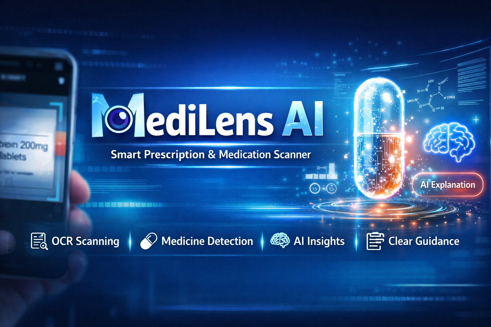

\

\<\!-- Hero Image / Banner Placeholder \--\>

\

# **💊 MediLens AI**

**Smart Prescription & Medication Analysis Engine**

*Transforming illegible medical prescriptions into clear, actionable, and safe insights using deterministic matching & constrained AI.*

[Features](https://www.google.com/search?q=%23-features) • [Architecture](https://www.google.com/search?q=%23-architecture) • [Quick Start](https://www.google.com/search?q=%23-quick-start) • [Disclaimer](https://www.google.com/search?q=%23%EF%B8%8F-disclaimer)

\</div\>

## **✨ The Vision**

**The Problem:** Medical handwriting and degraded printed prescriptions lead to confusion and potential safety risks for patients.

**The Solution:** MediLens AI extracts text via OCR, cross-references it against a verified local database using advanced fuzzy matching, and uses AI *only* to format the results—guaranteeing **zero medical hallucinations.**

## **🚀 Features**

| Feature | Description |
| :---- | :---- |
| **🔍 Resilient OCR Extraction** | Accurately extracts unstructured text from visual prescriptions, handling significant orthographic noise and typographic degradation. |
| **🎯 Deterministic Detection** | Utilizes a bespoke fuzzy-matching engine (RapidFuzz) to identify medications, completely ignoring OCR typos without guessing. |
| **🛡️ Zero-Hallucination AI** | Google Gemini LLM is sandboxed and used *exclusively* as a syntactical formatter to structure verified local data. |
| **⚡ Ultra-Low Latency** | Built entirely on asynchronous FastAPI with an optimized, single-pass iterative detection loop for lightning-fast responses. |
| **✨ Glassmorphism UI** | A sleek, fully responsive frontend engineered with Tailwind CSS, featuring interactive animations and real-time state management. |

## **🧠 Architecture**

MediLens AI operates on a **Hybrid Artificial Intelligence Pipeline**. Rather than delegating tasks to a single, unpredictable generative model, it enforces a strict, multi-step verification process:

graph LR  
    A\[📄 Prescription Image\] \--\>|OCR.space API| B(🔤 Raw Text)  
    B \--\>|RapidFuzz Engine| C{⚙️ Deterministic Matcher}  
      
    C \--\>|≥ 60% Match| D\[(🗄️ Verified DB)\]  
    C \--\>|\< 60% Match| E\[⚠️ AI Fallback\]  
      
    D \--\>|Strict Context| F(🤖 Gemini Formatter)  
    E \--\> F  
      
    F \--\>|Structured JSON| G\[💻 Glassmorphism UI\]

    classDef default fill:\#1e293b,stroke:\#ec4899,stroke-width:2px,color:\#fff;  
    classDef database fill:\#0f172a,stroke:\#3b82f6,stroke-width:2px,color:\#fff;  
    class D database;

## **📂 Project Structure**

* **api/** — *FastAPI application & route orchestration*  
  * main.py  
* **core/** — *Deterministic engines*  
  * loader.py — In-memory database caching  
  * matcher.py — Fuzzy-matching algorithm (RapidFuzz)  
  * ocr.py — Vision API integration  
* **data/** — *Ground-truth repositories*  
  * medicines.json  
  * instructions.json  
* **frontend/** — *Client interface*  
  * index.html — Premium Tailwind CSS dashboard  
* **llm/** — *AI formatting layer*  
  * explainer.py  
* **Root Configuration Files**  
  * .env.example — Environment variables template  
  * Dockerfile — Containerization spec  
  * requirements.txt — Python dependencies

## **🧪 Example Output**

**Input Scan:** *"take 1 paractemol daily"*

{  
  "success": true,  
  "medicines": \[  
    {  
      "name": "paracetamol",  
      "confidence": 88.5,  
      "level": "medium"  
    }  
  \],  
  "summary": "💊 Paracetamol\\n\\n🧾 Uses\\n• Pain relief\\n• Fever reduction\\n\\n💊 Dosage\\n500mg \- 1000mg administered every 4-6 hours\\n\\n⚠️ Always consult a doctor.",  
  "ocr\_text": "take 1 paractemol daily",  
  "processing\_time": 1.24  
}

## **⚡ Quick Start**

### **1\. Clone & Install**

git clone \[https://github.com/yourusername/medilens-ai.git\](https://github.com/yourusername/medilens-ai.git)  
cd medilens-ai

\# Activate virtual environment  
python \-m venv venv  
source venv/bin/activate  \# Windows: \`venv\\Scripts\\activate\`

\# Install dependencies  
pip install \-r requirements.txt

### **2\. Configure Environment**

Create a .env file in the root directory:

OCR\_SPACE\_API\_KEY=your\_ocr\_space\_api\_key\_here  
GEMINI\_API\_KEY=your\_google\_gemini\_api\_key\_here

### **3\. Launch the Engine**

uvicorn api.main:app \--reload \--host 0.0.0.0 \--port 8000

Navigate to http://localhost:8000 in your browser.

## **🐳 Docker Deployment**

Ready for the cloud. Deploy seamlessly to Render, AWS, or GCP:

docker build \-t medilens-ai .  
docker run \-p 8000:8000 \--env-file .env medilens-ai

## **⚖️ Disclaimer**

**MediLens AI is distributed strictly for informational and educational utility.** Under no circumstances should the output of this system be construed as a substitute for professional medical consultation, diagnostic evaluation, or therapeutic prescription. Always seek the counsel of a licensed physician. The developers disclaim all liability for any adverse consequences arising from reliance upon extracted or formatted data.

\

\<p\>\<b\>Built by Varsh Vishwakarma\</b\>\</p\>

\<p\>\<i\>AI • ML • DL • Data Science • Cloud • Full-Stack ML Developer\</i\>\</p\>

\</div\>
